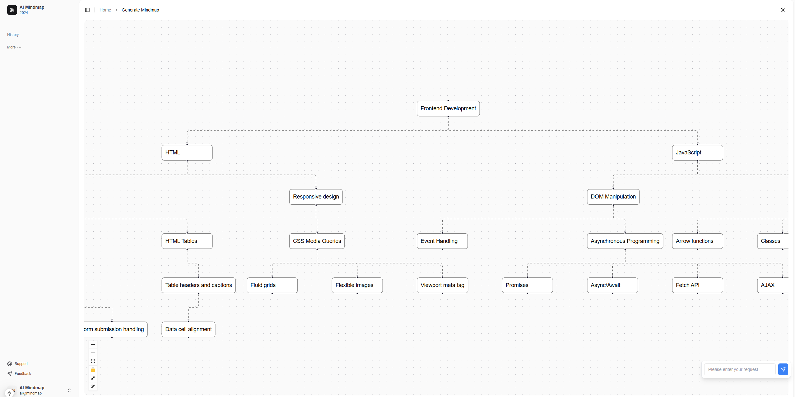

# AI Mindmap Client

An AI-powered mind mapping web application built with Next.js and Gemini API.
Auto Generate Mindmap with LLM

## Key Features

- 🧠 AI-powered automatic mind map generation
- 🌓 Light/dark mode support
- 📱 Responsive design
- ✏️ Direct node content editing
- 🔒 Lock/unlock mind map editing
- 🖼️ Fullscreen mode

## System Requirements

- Node.js 20.x or later
- pnpm

## Installation

1. Clone repository and install dependencies:
```bash
pnpm install
```
2. Create environment file from template:
```bash
cp env.example .env.local
```

3. Update `NEXT_PUBLIC_GEMINI_API_KEY` in `.env.local` with your API key

4. Start development server:
```bash
pnpm run dev
```

Visit [http://localhost:3000](http://localhost:3000) to see the result.

## Deployment

### Using Docker

1. Build image:
docker compose build
2. Run container:
docker compose up

## Technologies Used

- [Next.js](https://nextjs.org/) - React framework
- [Tailwind CSS](https://tailwindcss.com/) - CSS framework
- [shadcn/ui](https://ui.shadcn.com/) - UI components library
- [ReactFlow](https://reactflow.dev/) - Interactive diagram library
- [Gemini API](https://ai.google.dev/) - AI content generation

## Overview


## Roadmap & Future Development

### 1. Backend System
- Authentication & Authorization
  - User authentication with NextAuth.js
  - OAuth integration (Google, GitHub)
  - Role-based access control (RBAC)
  - Session management

- Database & Storage
  - PostgreSQL database integration
  - User data management
  - Mindmap storage and versioning
  - File attachments support

### 2. Enhanced AI Features
- RAG (Retrieval Augmented Generation)
  - Knowledge base integration
  - Custom training data support
  - Context-aware mindmap generation

- Advanced Prompting
  - Template management
  - Custom prompt library
  - Multi-language support
  - Style customization

### 3. Collaboration Features
- Real-time collaboration
- Shared workspaces
- Comment & feedback system
- Version control for mindmaps

### 4. Export & Integration
- Multiple export formats (PDF, PNG, SVG)
- Integration with popular tools
  - Notion
  - Miro
  - Google Workspace
  - Microsoft Office

### 5. Analytics & Insights
- Usage analytics
- Performance metrics
- User behavior tracking
- AI generation quality feedback

## Contributing

This project is maintained by JustOneMoreNight (justonefornight@gmail.com). Contributions are welcome! Please feel free to submit a Pull Request.
